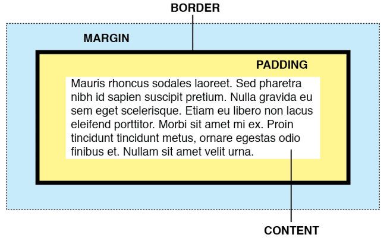

# CSS box model and units

Every HTML element is is represented as a rectangular box, with the box's content, padding, border, and margin built up around one another like the layers of an onion. Before understanding how to create CSS layouts, you need to understand the box model.

## CSS Box model




Let's review it:

### Width and height

The `width` and `height` properties set the width and height of the **content box**, which is the area in which the content of the box is displayed.

**Note** At the end of this document, we will change this behaviour

```css
.box {
  width: 200px;
  height: 400px;
}
```

### Padding

Padding refers to the inner margin of a CSS box — between the outer edge of the content box and the inner edge of the border.

```css
.box {
  padding: 2rem;
}
```

### Border

The border of a CSS box sits between the outer edge of the padding and the inner edge of the margin. By default the border has a size of 0 — making it invisible.

```css
.box {
  border: 2px solid red;
}
```

### Margin

The margin surrounds a CSS box, and pushes up against other CSS boxes in the layout. Like the padding, but external to the border.

```css
.box {
  margin: 2rem;
}
```

## CSS Units

Some CSS attributes require a unit value. Some that you might come across already is the pixel value (px) or the percentage (%). There are many, we will review the most important.

### Absolute numeric values

Absolute numberic values will always be the same size regardless of any other related settings like the screen or viewport.

- **Pixels** Used the be the value of every point in a screen, but due to the advent of advanced screens, is a complicated measure depending of your screen resolution. Anyway, a pixel will always be a pixel and will not be affected by other elements. Is the most commonly used unit for absolute units.

```css
.box {
  margin: 200px;
}
```

### Relative numeric values

Relative numberic values will change depending on other variables. It can change based on the system font-size or the viewport width, for example.

- **rem**: A `rem` will be the value of the default value of the browser font-size. By default, a browsers font-size will be `16px`. So, if the user do not change the default value, a REM equals 16px.

- **em**: A `em` is similar to the `rem` but only refered to the current element. If no element has set a font-size value, then it will fallback to root value (16px).

- **vw, vh**: Viewport width and viewport height. Respectively these are 1/100th of the width of the viewport, and 1/100th of the height of the viewport.

```css
.box {
  margin: 2rem;
  width: 30vw;
  height: 10vh;
}
```

### Unitless

If the value of an attribute is zero, you might see it without any values. This is not a mistake, but a good and common practice

```css
.box {
  margin: 0;
  width: 0;
  height: 0;
}
```

### Percentage

A percentage will take the percentage size of the parent container.

```css
.parent {
  width: 200px;
  height: 300px;
}

.child {
  width: 50%;
  height: 50%;
}
```

## Box model again

As we saw at the beggining of this chapter, the **actual** width and height of a box will be

> Width = Content-box + padding + border + margin

So if we do this:

```css
.box {
  width: 200px;
  border: 1px solid green;
  padding: 1rem;
  margin: 2rem;
}
```

The actual rendered width would be

> width = 200px + 1rem + 1px + 2rem

Hard to calculate, isn't it?

To avoid confusion, most of the developers change the default browser behaviour

### Box-sizing

`box-sizing` is a CSS property that sets how the total width and height of an element is calculated.
When we set the value of `box-sizing` to `border-box` the final calculation will differ. The width and height properties will include the content, padding, and border, but do not include the margin.

For example:

```css
.box {
  width: 200px;
  border: 1px solid green;
  padding: 1rem;
  margin: 2rem;
}
```

The actual rendered width would be 200px and will contain the border and the padding. And will have `2rem` margin.

To do this, most of the developers will use the universal selector

```css
* {
  box-sizing: border-box;
}
```

This is a very common feature, but has to be used carefully because changes the default behaviour of the box model of EVERY element.

Last example

```css
div {
  width: 160px;
  height: 80px;
  padding: 20px;
  border: 8px solid red;
  background: yellow;
}

.content-box { 
  box-sizing: content-box; 
  /* Total width: 160px + (2 * 20px) + (2 * 8px) = 216px
     Total height: 80px + (2 * 20px) + (2 * 8px) = 136px
     Content box width: 160px
     Content box height: 80px */
}

.border-box { 
  box-sizing: border-box;
  /* Total width: 160px
     Total height: 80px
     Content box width: 160px - (2 * 20px) - (2 * 8px) = 104px
     Content box height: 80px - (2 * 20px) - (2 * 8px) = 24px */
}
```