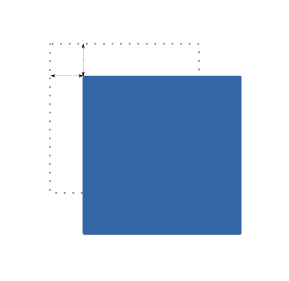
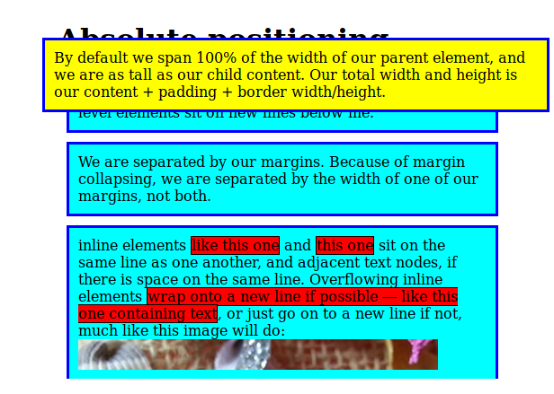
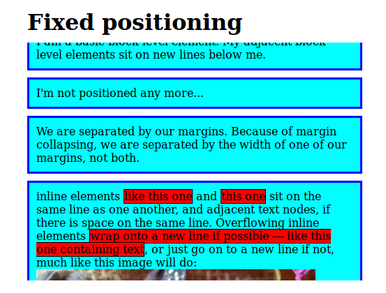
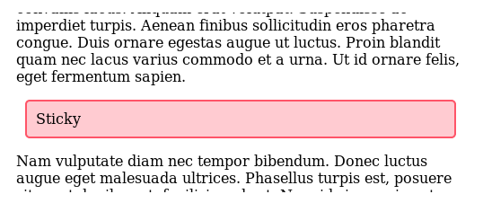
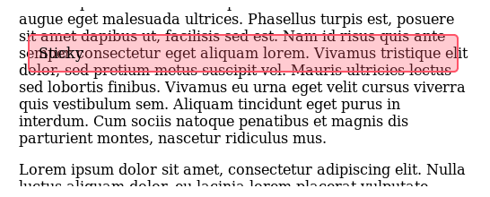

# CSS layout

CSS page layout techniques allow us to take elements contained in a web page and control where they are positioned relative to their default position in normal layout flow.

## Default layout flow: inline vs. block

Normal flow is how the browser lays out HTML pages by default when you do nothing to control page layout.
The elements that appear one below the other are described as **block elements**, in contrast to **inline elements**, which appear one beside the other, like the individual words in a paragraph.

### Block

By default, a block level element's content is 100% of the width of its parent element, and as tall as its content. Each one will appear on a new line below the last one, and they will be separated by any margin that is set on them (defauylt margin or any margin we set on CSS).

```html
<h1>Basic document flow</h1>
<p>I am a basic block level element. My adjacent block level elements sit on new lines below me.</p>
<p>By default we span 100% of the width of our parent element, and we are as tall as our child content. Our total width and height is our content + padding + border width/height.</p>
```

All this elements will appear on a different lines. Each one will sit in top of the other.

### Inline

Inline elements are as tall as their content, and as wide as their content.
Inline elements don't appear on new lines as block elements; instead, they sit on the same line as one another, as long as there is space for them to do so inside the width of the parent block level element. If there isn't space, then the overflowing text or elements will move down to a new line.

```html
<p><strong>By default we span 100% of the width of our parent element</strong>, <span>and we are as tall</span> <cite>as our child content.</cite> <em>Our total width and height</em> <a href="#">is our content + padding + border width/height.</a></p>
```

All this elements will appear on the same line inside the block element `<p>`

## Positioning

Positioning allows you to take elements out of the normal document layout flow, and make them behave differently; for example sitting on top of one another, or always remaining in the same place inside the browser viewport.

### Static

This is the default value.

> The element is positioned according to the normal flow of the document. The top, right, bottom, left, and z-index properties have no effect.

### Relative

> The element is positioned according to the normal flow of the document, and then offset relative to itself based on the values of top, right, bottom, and left. **The offset does not affect the position of any other elements**; thus, the space given for the element in the page layout is the same as if position were static.

This is very similar to static positioning, except that once the positioned element has taken its place in the normal layout flow, you can then modify its final position, including making it overlap other elements on the page.

`top`, `bottom`, `left`, and `right` are used alongside position to specify exactly where to move the positioned element to.

```css
.box {
    position: relative;
    top: 5px;
    left: 5px;
}
```



### Absolute

> The element is removed from the normal document flow, and no space is created for the element in the page layout. An absolutely positioned element no longer exists in the normal document layout flow. Instead, it sits on its own layer separate from everything else. This is very useful: it means that we can create isolated UI features that don't interfere with the position of other elements on the page. For example: popups, dialogs, floating menus...etc.

`top`, `bottom`, `left`, and `right` are used alongside position to specify exactly where to move the positioned element to.

**IMPORTANT: The box will be positioned relative to its closest positioned ancestor**, if any. What is a positioned ancestor? The nearest ancestor element that has a position value other than static (fixed, absolute, relative, or sticky). If no ancestor elements have their position property explicitly defined the box will be positioned relatively to the html element.

```css
.box {
  position: absolute;
  background: yellow;
  top: 30px;
  left: 30px;
}
```



### Fixed

> The element is removed from the normal document flow, and no space is created for the element in the page layout. It is positioned relative to the initial containing block. Its final position is determined by the values of top, right, bottom, and left.

This works in exactly the same way as absolute positioning, with one key difference: whereas absolute positioning fixes an element in place relative to the `<html>` element or its nearest positioned ancestor, **fixed positioning fixes an element in place relative to the browser viewport itself**.

```css
.box {
  position: fixed;
  top: 0;
  width: 500px;
  margin: 0 auto;
  background: white;
  padding: 10px;
}
```


### Sticky

> The element is positioned according to the normal flow of the document, and then offset relative to its nearest scrolling ancestor and containing block

Using this type of position, en element will be positioned as its position is `relative` until the paige is scrolled to a certain threshold point (e.g. 10px from the top of the viewport), after which it becomes `fixed`.

```css
.box {
  position: sticky;
  top: 30px;
  left: 30px;
}
```




## Flexbox

The main aim of flexbox is to craft one-dimensional layout structures (vertical or horizontal). Items in flex layouts will shrink or grow to fill the space available and will position relative to the parent container.

**Important** Although multi-dimensional grids can be accomplished by using flexbox, it is recommended to craft those layouts using [grid layouts](https://developer.mozilla.org/en-US/docs/Learn/CSS/CSS_layout/Grids).

**Important** Flexbox is relativelly new. Before flexbox, the only way to create CSS layouts were [floats](https://developer.mozilla.org/en-US/docs/Learn/CSS/CSS_layout/Floats). Although can be seen nowadays is strongly discouraged.

Please note that there is a difference between the parent container (flex container) and its children (flex children). Focus first on the parent properties that affect all children and then change children properties if needed.

### Flex element

To start with, we need to select which elements are to be laid out as flexible boxes. To do this, we set a special value of display on the parent element of the elements you want to affect.

```css
.box {
  display: flex;
}
```

The `.box` container will turn into a flex container and all its child elements will layout in columns, each one the same size.


#### Layout direction

By default, elements in a flex container will be set to `row` (horizontal) but we can alter the element position changing its `flex-direction` property to `column` (vertical)

```css
.box {
  display: flex;
  flex-direction: column;
}
```

#### Layout alignment

You can use flexbox to align the childrens of the parent element.

- **Align items** will align the items on vertical axis.
  - **stretch** This is the default value. Will stretch all items to meet the parent height.
  - **center** Will center all items vertically.
  - **flex-start** Will align items to the beggining of the parent.
  - **flex-end** Will align items to the end of the parent.

- **Justify content** will align the items on horizontal axis.
  - **flex-start** This is the default value.  Will align items to the beggining of the parent.
  - **flex-end** Will align items to the end of the parent.
  - **center** Will center all items horizontally.
  - **space-between** Will layout the items in the full width of the parents but will not grow the width of the children and leaves some space at the end.
  - **space-around** Will layout the items in the full width of the parents separated  but will not grow the width of the children.

Since this might be a complicated (and a bit abstact) explanation, read this interesting resources:

- [A guide to flexbox by **CSS tricks**](https://css-tricks.com/snippets/css/a-guide-to-flexbox/)
- [Flexbox Froggy: a game to learn flexbox](https://flexboxfroggy.com/)


### Flex children

Do you remember the parent flex container, don't you? Each of the child elements has been laid out as flexible, each one the same size.

#### Flex property

The flex property is a unitless proportion value that dictates how much of the available space each flex item will take up.

```css
.box-child:nth-child(2) {
  flex: 2;
}
```

In this example, the second element will take up twice as much of the available width as the other elements. Imagine we have three elements. The fist and the third one will take now 1/4 of the available space each, while the second will take the double (1/2). Note that, by default, each element has a flex value of 1.

Actually, flex property is just a shorthand of the properties.

- Flex-grow: The unitless proportion value we discussed above.
- Flex-shrink: The opposite, how much an element can shrink if the container is too small.
- Flex-basis: Minimum size value inside the flex value. Like a fallback, sets the minimum size of an element.

```css
.box-child:nth-child(2) {
  /* flex: 1; */
  flex-grow: 1; /* Will take a proportional part if parent grows */
  flex-shrink: 1; /* Will shrink a proportional part if parent shrinks */
  flex-basis: auto; /* Minimum size of the box (can grow) */
}
```