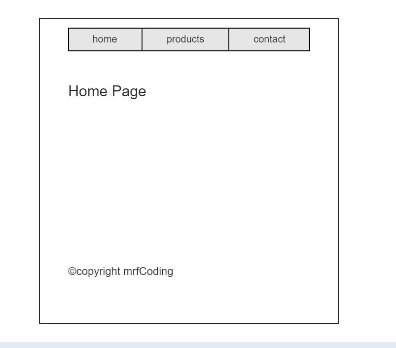

# Our firsts pages

- We need a header component, with 3 buttoms home, products and contact.

- We need create 3 pages this will be components.
The page are exactly the same but each page have one different text.
In the home page you can read "home page", in the product page you read "product page" and in the contact page you can read "contact page".

- We need create another component, copyright component. This a little component with the text "©copyright mrfCoding".
This component we put in the bottom the 3 pages.

- The last step. When you click in your home button in the header all page will hide them and then the only show home page.
This behavior is the same for rest button with the others pages.

