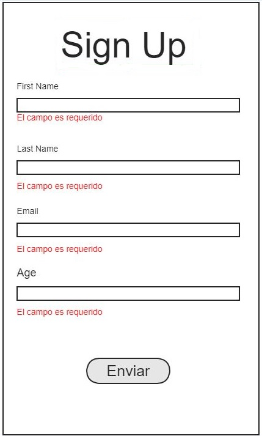

## Registration Form

  You must create a registration form that meets
The following validations.

- First name, last name, age and email are required fields.
- Email must have an @ and a period ".".
- Age has to be an integer, without decimals.
  It must also be greater than zero and less than 110 years.

  Other requirements to consider.
  
- If one or more validations fail, the error must be shown below the input.
- If all validations are correct, display the user data. it shows with an alert is enough.
- Keep in mind that an input can have more than one error. Therefore, depending on an error, a different message must be displayed.

