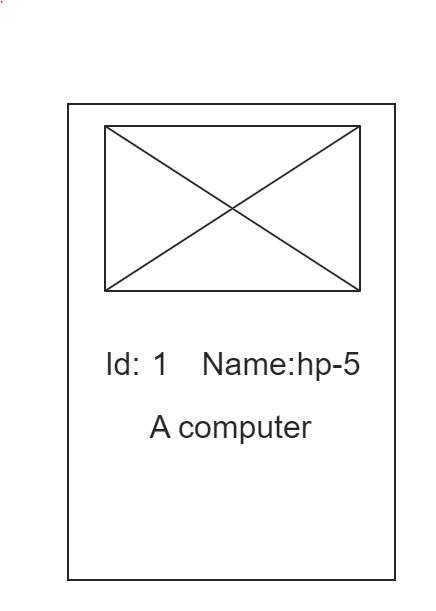
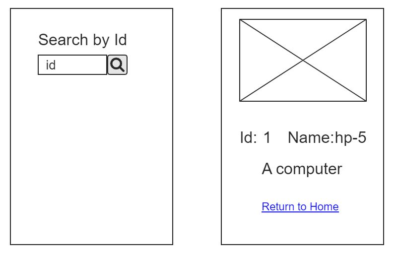

# Exercise Vue-Parameters

We have previously created our first web application using
Vue router Now we go a little further.

if you need more information you could find it in the vue router documentation.
https://router.vuejs.org/

In the next exercise we will pass a parameter through
the url.

This parameter will be the identification of one of our products.

As an example, when we type in the browser "http://localhost:8080/products/1" we will collect the identification and look for the product information in an array that we will have prepared beforehand.

Example of possible array
``` js
[
    {
        id: 0,
        name: "hp-5",
        description: "a computer"
    },
    {
        id: 1
        name: "hp printer",
        description: "hp printer"
    },
    {
        id: 2
        name: "magic beans",
        Description: "Caution, do not eat, you can grow a plant the size of a scratch in the stomach"
    }
]
```

Example of exercise.




- Extra:
- If the identification does not correspond to a list of products, hide the html elements and display the following message "The product does not exist".
- Create a second page to search for products that will be the main page and on the products page add a vue router link to return to the main page, that is, the product search.

Example of exercises with extras.


