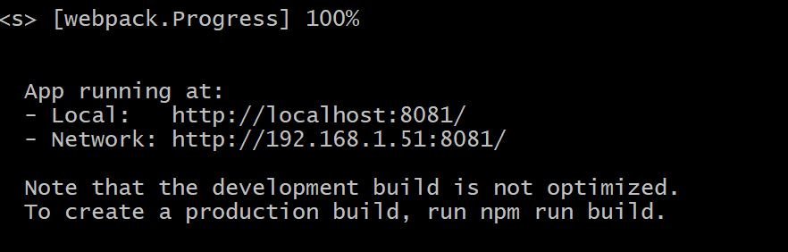
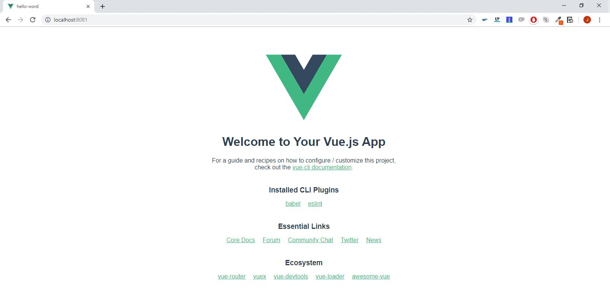

# Tooling

So far we have been working with javascript without tools. Today we will discover that there are all kinds of tools to help us work with javascript, these are tools that make it easy for us to add complex processes to our javascript in a simple way.


## NPM And Node

### Node
The Node.js is a  run-time environment includes everything you need to execute a program written in JavaScript.

### NPM

**npm**, short for Node Package Manager, is two things: first and foremost, it is an online repository for the publishing of open-source Node.js projects; second, it is a command-line utility for interacting with said repository that aids in package installation, version management, and dependency management. A plethora of Node.js libraries and applications are published on npm, and many more are added every day. These applications can be searched for on http://search.npmjs.org/. Once you have a package you want to install, it can be installed with a single command-line command.


### Install
The first step to start running the tools to work with javascript will be to install node in whose installation includes npm. Node will allow us to execute js code without having to depend on the browser, this includes our new tools and npm will allow us to download any tool easily.

To install node we go to https://nodejs.org/en/ and download the version lts


## VUE-Cli - Standard Tooling for Vue.js Development
Normally in long-term projects it is normal to create our own system of tools to process javascript. But there are times when it can be very useful to use a system previously created by others, this is vue-cli. Vue-cli is a kit standard Tooling for Vue.js


### What does vue-cli give us?
Vue-cli give us a lot of functionalities the most important for us. We can work with ".Vue" files.


### Getting Started With vue-cli

- First step. Install how global dependency vue-cli in npm. Open the terminal write the next command and wait until the download has been finish.
```
npm install -g @vue/cli
```

- Second step. Create a new proyect. For this write the next command in the console.
In this moment vue-cli will ask you about the configuration only press enter for load default configuration.
And wait until the download has been finish.
```
vue create pajaritos
```

- Third step. Use the command cd for introduce into your proyect folder then
  execute "npm run serve". Wait some seconds and you has been open your local server, now you can go to browser and check that your local server is working.
```
cd pajaritos
npm run serve
```








